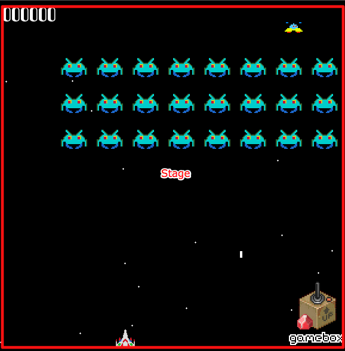
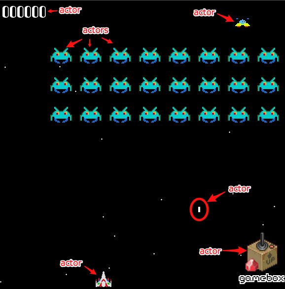
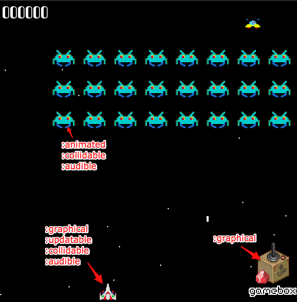

!SLIDE bullets incremental
# Why Ruby? #

* readability
* expressive / DSL
* P.O.L.S.
* great community

!SLIDE center
# Who are you? #

~~~SECTION:notes~~~

  How many Ruby users; how advanced; any game dev; what?

~~~ENDSECTION~~~

!SLIDE center
# Example #

!SLIDE
	@@@ ruby
	define_actor :player do
	  has_behaviors do
	    slicer
	    shooter recharge_time: 4_000
	    bomber kickback: 1.6
	    shielded

	    die_by_sword
	    die_by_bomb
	    die_by_bullet

	    blasted_by_bomb
	    disoriented_by_bombs
	    pulled_by_black_hole
	    jump max_power: 80, min_power: 20
	    tile_oriented
	  end
	end

!SLIDE bullets center
# Options #

* libGDX via JRuby
* Joybox, via Rubymotion
* Gosu

!SLIDE 
# Gosu #

* C++ / Ruby bindings  \o/
* win / mac / linux
* low level access gfx, audio, and input
* libgosu.org

!SLIDE center

!SLIDE
	@@@ ruby
	class GameWindow < Gosu::Window

	  def update
	  end

	  def draw
	  end

	  def button_down(id)
	  end
	end
	window = GameWindow.new 640, 480, false
	window.show

!SLIDE

# Gamebox #
# lets your brain talk to ruby #
## http://github.com/shawn42/gamebox ##

!SLIDE bullets incremental
# Gamebox Goals #

* New game up and running quickly
* Allow for clear DSL
* DRY: prebuilt objects and behaviors
* Helpful, not in the way
* Testable

!SLIDE bullets incremental

# Gamebox Concepts #

* Lights, Camera, Action!
* Every object in a game is an Actor
* Actors have Behaviors
* Actors exist on a Stage
* Actors do NOT draw, ActorViews do

!SLIDE center bullets
# Stages #

* where the action happens
* actors get added here
* intro => main game => credits
* not level 1 => level 2
* running mode vs swimming mode 
!SLIDE center

!SLIDE center bullets
# Actors #

* hold observable data
* have behaviors that can be added / removed
* act as mini event bus
!SLIDE center

!SLIDE center bullets
# Behaviors #

* where actor specific things happen
* operate on their actors
* jumper / slicer / die by spike pit
!SLIDE center

